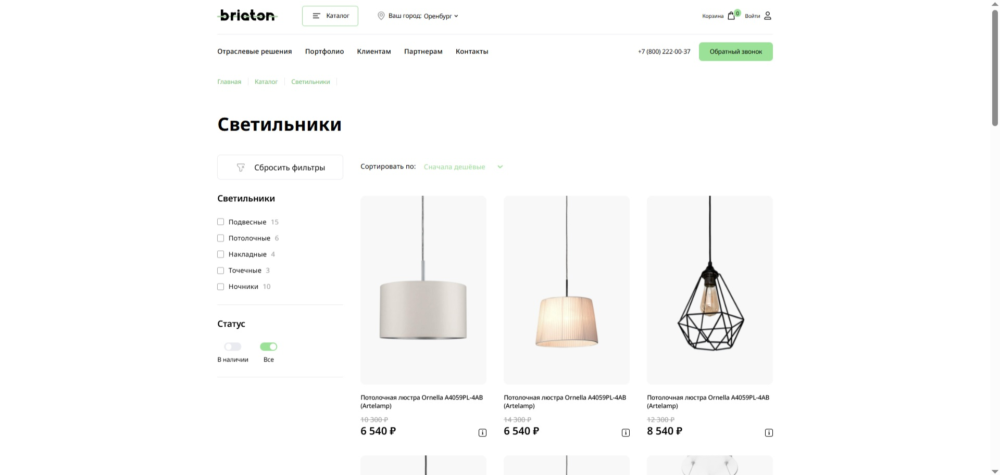

# Briaton - Интернет-магазин светильников

Одностраничный сайт для интернет-магазина осветительных приборов "Briaton". Проект включает главную страницу с каталогом товаров, системой фильтрации и интерактивными элементами.

**[Посмотреть живую демонстрацию](https://oxana48.github.io/js-project/)**



## Технологии

- **HTML5** (семантическая верстка, доступность)
- **CSS3** (Flexbox, Grid, адаптивная верстка, анимации)
- **Vanilla JavaScript** (ES6+, модули, работа с DOM)
- **Методология БЭМ** для организации CSS
- **SVG-спрайты** для иконок

## Использованные библиотеки

- [Swiper](https://swiperjs.com/) - современный слайдер
- [JustValidate](https://just-validate.dev/) - валидация форм
- [Tippy.js](https://atomiks.github.io/tippyjs/) - всплывающие подсказки
- [Popper.js](https://popper.js.org/) - позиционирование выпадающих элементов

## Ключевые особенности

- **Десктопная версия**
- **Интерактивный интерфейс**:
  - Многоуровневое меню с каталогом товаров
  - Визуальные фильтры с чекбоксами и радио-кнопками
  - Всплывающая корзина товаров
  - Слайдер "Товары дня" с навигацией
  - Аккордеон для раздела FAQ
  - Форма с валидацией
- **Оптимизация производительности**:
  - SVG-иконки в виде спрайта
  - Оптимизированные изображения
  - Эффективная работа с DOM

## Запуск проекта

1. Клонируйте репозиторий:
```bash
git clone https://github.com/Oxana48/js-project
```

2. Перейдите в папку проекта и откройте файл `index.html` в браузере.

Или воспользуйтесь Live Server в VS Code для запуска локального сервера.